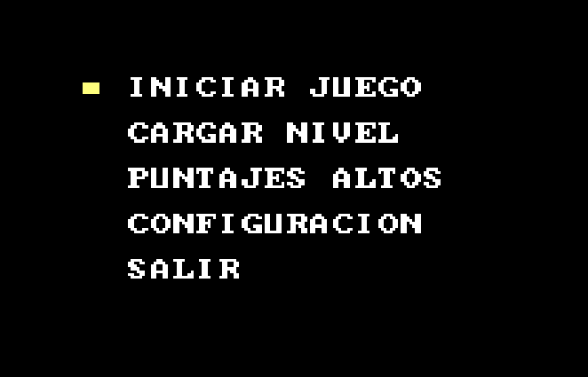
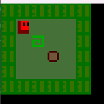

# **Proyecto 2**
### Universidad de San Carlos de Guatemala
### Facultad de Ingeniería
### Escuela de Ciencias y Sistemas
### Arquitectura de Computadores y Ensambladores 1
### Sección N
  

## **Manual de Usuario**
  

| Nombre | Carnet | 
| --- | --- |
| José Manuel Ibarra Pirir | 202001800 |
----
# **Descripción General**

El proyecto consiste en una réplica del juego Sokoban. Este juego contará con un menu principal para poder movilizarse con las difernete funciones.

# **Requerimientos**
- DOSBox
- MASM

# **Ejecución**

1. Abrir DOSBox
2. Compilar el archivo `main.asm` con el comando `ml main.asm`
3. Ejecutar el archivo `main.exe` con el comando `main.exe`

# **Menu Principal**

1. La primera opcion es la de iniciar partida, que inicia secuencialmente los niveles 00, 01, 02.
2. La segunda opcion es la de cargar nivel, que pide el nombre del archivo que desea ingresar y si existe lo carga.
3. La tercera opcion es la de salir, que cierra el programa.

# **Juego**
Una vez en el juego puedes moverte con las teclas de direccionamiento, si se quiere poner pausa presionar F2.

